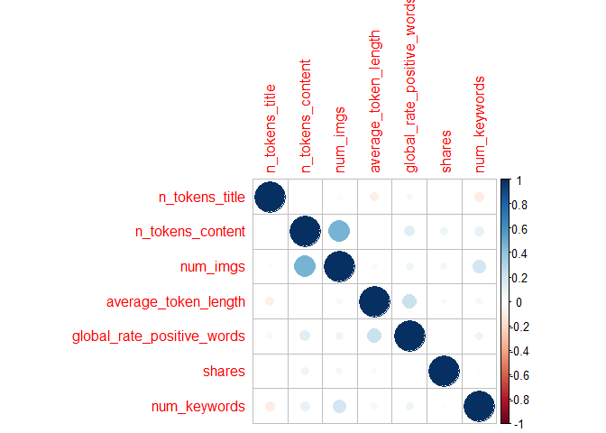
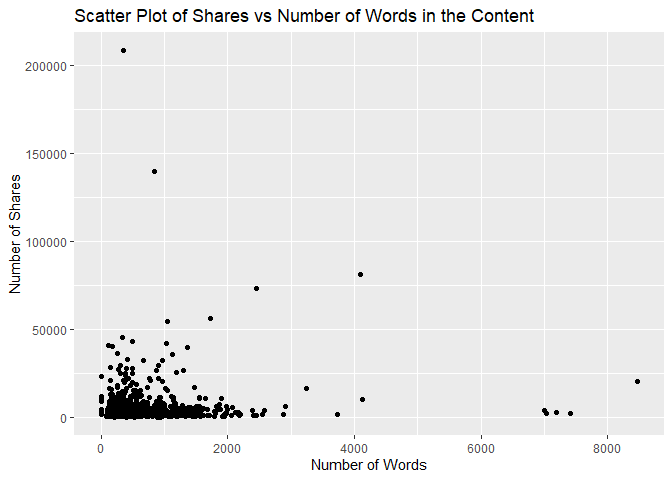
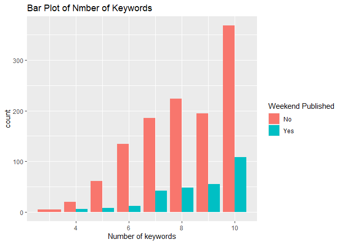
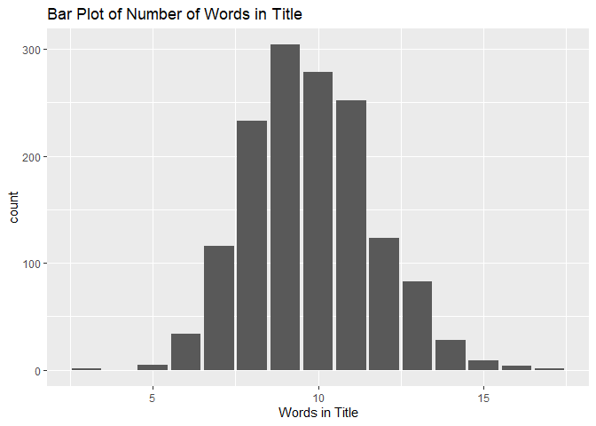
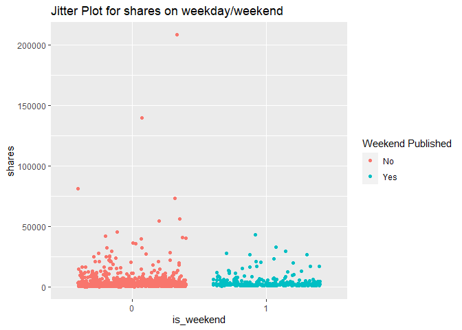
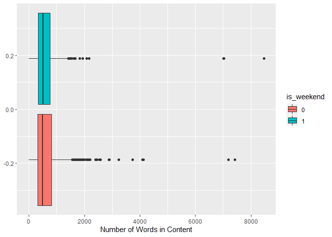
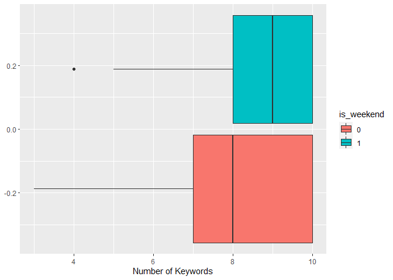

ST 558 Project 3
================
Katelyn Settlemyre, Xi Zeng
2022-10-13

# Package List

Below is the package list needed for this project.

``` r
library(tidyverse)
library(caret)
library(MASS)
library(randomForest)
```

# Introduction

The data set used for analysis is the `OnlineNewsPopularity` sudata set
from UCI Machine Learning Repository. The data set has 61 variables in
total, as well as 39644 observations. First, we will take a subset data
set by filter according to the data channel. The lifestyle channel is
first chosen for analysis.  
For our project, we will take variables(With description of each
variable):  
+ `n_tokens_title`: Number of words in the title  
+ `n_tokens_content`: Number of words in the content  
+ `num_imgs`: Number of images  
+ `average_token_length`: Average length of the words in the content  
+ `is_weekend`: Was the article published on the weekend?  
+ `global_rate_positive_words`: Rate of positive words in the content  
+ `num_keywords`: Number of keywords in the metadata

The response variable that we are interested in is the `shares`
variable, which stands for the number of sales in social network. A
basic EDA will be performed at first to examine the relationship between
covariates and `shares`. Then predicted modeling is applied to predict
the number of sales, which will be illustrated in detail below.

# Data read in

``` r
#Read in data
news <- readr::read_csv("OnlineNewsPopularity.csv", show_col_types = FALSE)

#Subset data with a single data channel
subnews <- subset(news, data_channel_is_lifestyle == 1)

#Select variables for modeling and EDA
subnews <- subnews %>% dplyr::select(n_tokens_title,n_tokens_content,num_imgs,average_token_length,is_weekend,global_rate_positive_words,shares,num_keywords)
subnews$is_weekend <- as.factor(subnews$is_weekend)
```

# Data Split

In this part, our data set is split into training set and test set, with
training set contains 70% of the data and test set contains the other
30%.

``` r
#Set seed for reproduction
set.seed(123)

#Split data
index <- createDataPartition(subnews$shares,p = 0.7,list = FALSE)
train <- subnews[index,]
test <- subnews[-index,]
```

# Summarizations and EDA

In this part, basic summary statistics for the predictors are
calculated. Also, some plots,including scatter plots, barplots, and
boxplots, as well as frequency tables are generated to examine the
relationship between the variables.

``` r
#Define function for producing summary statistics
sum <- function(x){
  min <- min(x)
  mean <- mean(x)
  median <- median(x)
  max <- max(x)
  sd <- sd(x)
  return(list(Minimum = min, Mean = mean, Median = median, Maximum = max, `Standard Deviation` = sd(x)))
}

#Calculate summary statistic for variables
sum(subnews$n_tokens_title)
```

    ## $Minimum
    ## [1] 3
    ## 
    ## $Mean
    ## [1] 9.765603
    ## 
    ## $Median
    ## [1] 10
    ## 
    ## $Maximum
    ## [1] 18
    ## 
    ## $`Standard Deviation`
    ## [1] 1.909371

``` r
sum(subnews$n_tokens_content)
```

    ## $Minimum
    ## [1] 0
    ## 
    ## $Mean
    ## [1] 621.3273
    ## 
    ## $Median
    ## [1] 502
    ## 
    ## $Maximum
    ## [1] 8474
    ## 
    ## $`Standard Deviation`
    ## [1] 566.0532

We also show correlations between our selected variables. We show both a
correlation matrix and correlation plot.

``` r
#correlation matrix
(corrs <- cor(subnews[,-5]))
```

    ##                            n_tokens_title n_tokens_content    num_imgs average_token_length
    ## n_tokens_title                 1.00000000       0.01270988 -0.02146633          -0.08784754
    ## n_tokens_content               0.01270988       1.00000000  0.46442622           0.01542431
    ## num_imgs                      -0.02146633       0.46442622  1.00000000          -0.03657573
    ## average_token_length          -0.08784754       0.01542431 -0.03657573           1.00000000
    ## global_rate_positive_words    -0.04843500       0.12779576  0.06914830           0.21933431
    ## shares                        -0.00408709       0.07302425  0.05120130          -0.03056319
    ## num_keywords                  -0.09225501       0.09160223  0.18306212          -0.04764914
    ##                            global_rate_positive_words       shares num_keywords
    ## n_tokens_title                           -0.048434998 -0.004087090  -0.09225501
    ## n_tokens_content                          0.127795759  0.073024252   0.09160223
    ## num_imgs                                  0.069148297  0.051201300   0.18306212
    ## average_token_length                      0.219334312 -0.030563188  -0.04764914
    ## global_rate_positive_words                1.000000000 -0.005395787   0.07306212
    ## shares                                   -0.005395787  1.000000000   0.01969170
    ## num_keywords                              0.073062121  0.019691702   1.00000000

``` r
#correlation plot
corrplot::corrplot(corrs)
```



Our correlation matrix and plot shows that we don’t have strong
relationships between variables. The strongest relationship is a
correlation of 0.46 between `n_tokens_content` and `num_imgs`.

After producing summary statistics, some plots and tables are shown
below:

## Frequency tables

Below shows the frequency table of number of keywords.

``` r
 table(train$num_keywords)
```

    ## 
    ##   3   4   5   6   7   8   9  10 
    ##   5  26  69 146 228 272 250 476

According to the table, most of the articles have more than 5 keywords.
We assume that more keywords in the metadata will increase shares.

Here we have a frequency table of number of articles published on a
weekend.

``` r
table(subnews$is_weekend)
```

    ## 
    ##    0    1 
    ## 1707  392

According to this table, we see that approximately one fifth of the
articles in our data are published on the weekend.

## Scatter plots

Below are the scatter plots for the chosen variables.

``` r
ggplot(data = train, aes(x = global_rate_positive_words, y = shares))+
geom_point(aes(color = is_weekend)) +
  labs(x = "Rate of positive words in the content",
       y = "Number of Shares",
       title = "Scatter Plot of Shares vs Rate of positive words in the content") +
  scale_color_discrete(name = "Weekend Published", labels = c("No", "Yes"))
```


According to the scatter plot above, it seems that when the rate of
positive words exceeds 0.075, the number of shares of the article is
relatively small. Also, those articles with high shares are mostly
published during weekdays rather than weekend.

``` r
ggplot(data = train, aes(x= n_tokens_content,y = shares)) + 
  geom_point() + 
  labs(x = "Number of Words",
       y = "Number of Shares",
       title = "Scatter Plot of Shares vs Number of Words in the Content")
```


The above plot suggests articles with 2000 or fewer words are more
likely to be shared than articles with more than 2000 words.

## Barplots

Below is the bar plot for the number of keywords：

``` r
# Create bar plot of predictor "is_weekend"
g <- ggplot(data = train, aes(x = num_keywords, fill= is_weekend))
g + geom_bar(aes(fill = is_weekend),position = "dodge") +
  xlab("Number of keywords")+
  ggtitle("Bar Plot of Nmber of Keywords")+
  scale_fill_discrete(name = "Weekend Published", labels = c("No", "Yes"))
```



According to the bar plot, the frequency count of the each number of
keywords is shown, also ,it will be group into weekday and weekend to
see if there is any difference between them.

``` r
ggplot(data = train, aes(x= n_tokens_title)) + 
  geom_bar() + labs(x="Words in Title", title = "Bar Plot of Number of Words in Title")
```


This bar plot shows counts of articles by number of words in the title.
Most of our articles have between 8 and 11 words in the title.

## Boxplots

Below are the box plot for sales:

``` r
g <- ggplot(train, aes(x = is_weekend, y = shares))
g + geom_point(aes(color = is_weekend), position = "jitter")+
  ggtitle("Jitter Plot for shares on weekday/weekend") + xlab("is_weekend")+
  scale_color_discrete(name = "Weekend Published", labels = c("No", "Yes"))
```



A jitter plot is generated to see the spread of shares data in weekdays
and weekends.

Here, we show boxplots for number of words in the article by weekend and
number of keywords by weekend.

``` r
ggplot(data=train, aes(x=n_tokens_content)) +
  geom_boxplot(aes(fill=is_weekend)) +
  labs(x = "Number of Words in Content")
```



This pair of plots suggests there’s not much difference between weekends
and weekdays for number of words in a given article.

``` r
ggplot(data=train, aes(x=num_keywords)) +
  geom_boxplot(aes(fill=is_weekend)) +
  labs(x = "Number of Keywords")
```


This pair of plots suggests that articles published on the weekend use
more keywords than those published on a weekday.

# Model fitting

Below is the model fitting part. In this part, four models are fitted.
They are: linear regression model, random forest model and boosted tree
model. For testing goodness of fit, we will be using the root mean
squared error (RMSE).

## Linear Regression

We fit two different linear regression models here. Linear regression is
a basic method to find a linear relationship between a response variable
and one or more predictor variables. Here we will fit models using a
forward selection of the predictor variables as well as a subset
selection of variables and interaction terms.  
First we fit the forward selection.

``` r
#Use forward selection to determine the predictors used for the model
lm_forward <- train(shares~ .,
                    data = train,
                    method = "glmStepAIC",
                    direction = "forward",
                    trControl = trainControl("cv",number=10),
                    trace = FALSE)
lm_forward$finalModel
```

    ## 
    ## Call:  NULL
    ## 
    ## Coefficients:
    ##          (Intercept)      n_tokens_content  average_token_length  
    ##             5908.456                 1.196              -638.876  
    ## 
    ## Degrees of Freedom: 1471 Total (i.e. Null);  1469 Residual
    ## Null Deviance:       1.138e+11 
    ## Residual Deviance: 1.129e+11     AIC: 30910

``` r
#Fit model with selected variables on test data
lmod_pred <- predict(lm_forward, newdata = test)

#Calculate test error
lmod1_RMSE <- RMSE(lmod_pred,test$shares)
lmod1_RMSE
```

    ## [1] 9078.315

Now we fit the subset selection.

``` r
#Fit linear model using subset method
lm_subset <- train(shares~.^2,
                   data = train,
                   method = "lmStepAIC",
                   trControl = trainControl("cv",number=5),
                   trace = FALSE)
lm_subset$finalModel
```

    ## 
    ## Call:
    ## lm(formula = .outcome ~ `n_tokens_title:num_imgs` + `n_tokens_content:num_imgs` + 
    ##     `n_tokens_content:global_rate_positive_words` + `n_tokens_content:num_keywords` + 
    ##     `average_token_length:global_rate_positive_words` + `average_token_length:num_keywords`, 
    ##     data = dat)
    ## 
    ## Coefficients:
    ##                                       (Intercept)                          `n_tokens_title:num_imgs`  
    ##                                         3.699e+03                                          6.241e+00  
    ##                       `n_tokens_content:num_imgs`      `n_tokens_content:global_rate_positive_words`  
    ##                                        -3.147e-02                                          1.613e+02  
    ##                   `n_tokens_content:num_keywords`  `average_token_length:global_rate_positive_words`  
    ##                                        -6.304e-01                                         -2.119e+04  
    ##               `average_token_length:num_keywords`  
    ##                                         7.664e+01

``` r
lm_subset$results

#fit with test data
lsub_pred <- predict(lm_subset, newdata = test)

#test error:
(lmod2_RMSE <- RMSE(lsub_pred,test$shares))
```

    ## [1] 9072.598

## Random Forest Model

Here we fit a random forest model. A random forest is an method where
multiple tree models are fit from bootstrap samples using a subset of
predictor variables for each bootstrap sample. The final prediction is
an average of the bootstrap predictions. We use the tuning parameter
`mtry`, the number of randomly selected predictors, using values 1
through 5 to see fit the best tune.

``` r
#set tuning parameters
rand_grid <- data.frame(mtry=1:5)

#train model
rand_fit <- train(shares~.,
                  data = train,
                  method = "rf",
                  preProcess = c("center", "scale"),
                  trControl = trainControl(method = "repeatedcv", number = 5, repeats = 3),
                  tuneGrid = rand_grid)
rand_fit$bestTune
rand_fit$finalModel
```

    ## 
    ## Call:
    ##  randomForest(x = x, y = y, mtry = param$mtry) 
    ##                Type of random forest: regression
    ##                      Number of trees: 500
    ## No. of variables tried at each split: 1
    ## 
    ##           Mean of squared residuals: 77906195
    ##                     % Var explained: -0.76

``` r
#fit with test data
rand_pred <- predict(rand_fit, newdata = test)

#test error:
(rand_RMSE <- RMSE(rand_pred, test$shares))
```

    ## [1] 9074.526

## Boosted Tree Model

Below is the process of fitting a boosted tree model. A boosted tree is
a method that builds sequentially. It’s a slow-building method, that
builds a new tree considering the error of the previous fit, updating
predictions each new fit. Model performance is tested by fitting the
final tuned model on test set and calculate the test RMSE. Here, I use
combinations the following tuning parameters:  
+ `n.trees`, the number of boosting iterations, with values 25, 50, 100,
150, and 200  
+ `interaction.depth`, the maximum tree depth, with values 1 through 5  
+ `shrinkage`, the learning rate of the model, with values 0.1, 0.2,
0.3, 0.4, and 0.5, and  
+ `n.minobsinnode`, the minimum node size, here using 10.

``` r
#Set tuning grid for boosted tree model
boost_grid <- expand.grid(n.trees = c(25,50,100,150,200),
                          interaction.depth = c(1:5),
                          shrinkage = c(0.1,0.2,0.3,0.4,0.5),
                          n.minobsinnode = 10)
boost_grid

#Train the model
boost_fit <- train(shares ~., data = train,
                   method = "gbm",
                   trControl = trainControl(method = "repeatedcv", number = 5, repeats = 3),
                   preProcess = c("center", "scale"),
                   tuneGrid = boost_grid,
                   verbose = FALSE)

boost_fit$bestTune

#Fit the final boosted tree model with test data
boost_pred <- predict(boost_fit, newdata = test)

#Calculate test RMSE for model performance
boost_RMSE <- RMSE(boost_pred,test$shares)
boost_RMSE
```

    ## [1] 9092.104

# Comparison

Though the RMSE for the testing data has been given for each model in
the previous section, we shall display them here and compare the models’
performances.

``` r
data.frame(Model = c("Linear Regression, forward", "Linear Regression, subset", "Random Forest", "Boosted Tree"), 
           RMSE = c(lmod1_RMSE, lmod2_RMSE, rand_RMSE, boost_RMSE))
```

We want the model with the lowest RMSE. Comparing models, it seems that
the linear regression model with the interaction terms has the lowest
RMSE, followed by the random forest model, the linear regression model
with only first order terms, and lastly the boosted tree. In this case
we would want to choose the linear regression model with the interaction
terms for prediction.

# Automation
