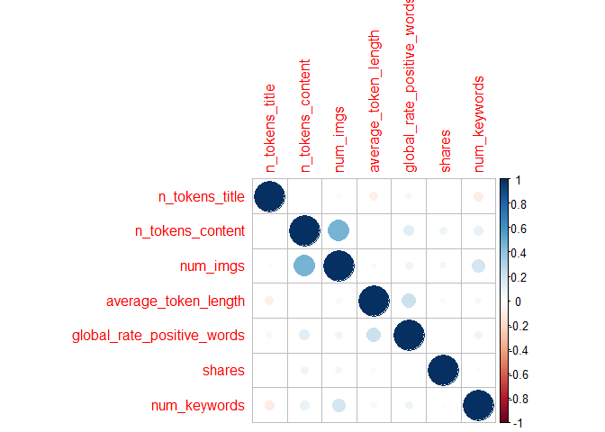
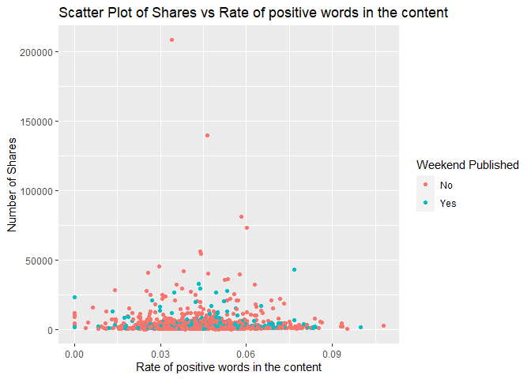
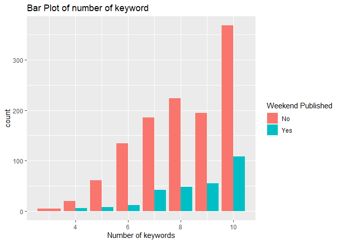
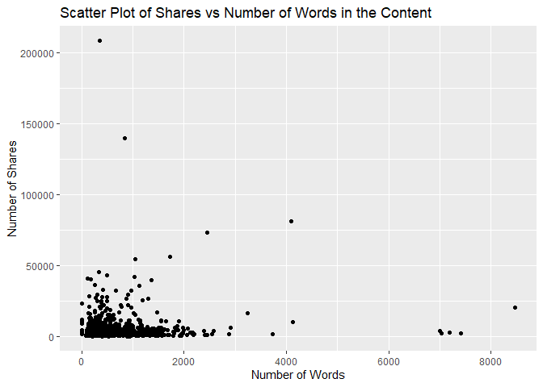

ST 558 Project 3
================
Katelyn Settlemyre, Xi Zeng
2022-10-13

# Package List

Below is the package list needed for this project.
`{r， warning = FALSE, message=FALSE} library(tidyverse) library(caret) library(MASS) library(randomForest)`

# Introduction

The data set used for analysis is the `OnlineNewsPopularity` data set
from UCI Machine Learning Repository. The data set has 61 variables in
total, as well as 39644 observations. First, we will take a subset data
set by filter according to the data channel. The lifestyle channel is
first chosen for analysis.  
For our project, we will take variables(With description of each
variable):  
+ `n_tokens_title`: Number of words in the title  
+ `n_tokens_content`: Number of words in the content  
+ `num_imgs`: Number of images  
+ `average_token_length`: Average length of the words in the content  
+ `is_weekend`: Was the article published on the weekend?  
+ `global_rate_positive_words`: Rate of positive words in the content  
+ `num_keywords`: Number of keywords in the metadata

The response variable that we are interested in is the `shares`
variable, which stands for the number of sales in social network. A
basic EDA will be performed at first to examine the relationship between
covariates and `shares`. Then predicted modeling is applied to predict
the number of sales, which will be illustrated in detail below.

# Data read in

``` r
#Read in data
news <- read_csv("OnlineNewsPopularity.csv", show_col_types = FALSE)

#Subset data with a single data channel
subnews <- subset(news, data_channel_is_lifestyle == 1)

#Select variables for modeling and EDA
subnews <- subnews %>% dplyr::select(n_tokens_title,n_tokens_content,num_imgs,average_token_length,is_weekend,global_rate_positive_words,shares,num_keywords)
subnews$is_weekend <- as.factor(subnews$is_weekend)
```

# Data Split

In this part, our data set is split into training set and test set, with
training set contains 70% of the data and test set contains the other
30%.

``` r
#Set seed for reproduction
set.seed(123)

#Split data
index <- createDataPartition(subnews$shares,p = 0.7,list = FALSE)
train <- subnews[index,]
test <- subnews[-index,]
```

# Summarizations and EDA

In this part, basic summary statistics for the predictors are
calculated. Also, some plots,including scatter plots, barplots, and
boxplots, as well as frequency tables are generated to examine the
relationship between the variables.

``` r
#Define function for producing summary statistics
sum <- function(x){
  min <- min(x)
  mean <- mean(x)
  median <- median(x)
  max <- max(x)
  sd <- sd(x)
  return(list(Minimum = min, Mean = mean, Median = median, Maximum = max, `Standard Deviation` = sd(x)))
}

#Calculate summary statistic for variables
sum(subnews$n_tokens_title)
```

    ## $Minimum
    ## [1] 3
    ## 
    ## $Mean
    ## [1] 9.765603
    ## 
    ## $Median
    ## [1] 10
    ## 
    ## $Maximum
    ## [1] 18
    ## 
    ## $`Standard Deviation`
    ## [1] 1.909371

``` r
sum(subnews$n_tokens_content)
```

    ## $Minimum
    ## [1] 0
    ## 
    ## $Mean
    ## [1] 621.3273
    ## 
    ## $Median
    ## [1] 502
    ## 
    ## $Maximum
    ## [1] 8474
    ## 
    ## $`Standard Deviation`
    ## [1] 566.0532

We also show correlations between our selected variables. We show both a
correlation matrix and correlation plot.

``` r
#correlation matrix
(corrs <- cor(subnews[,-5]))
```

    ##                            n_tokens_title n_tokens_content    num_imgs average_token_length global_rate_positive_words
    ## n_tokens_title                 1.00000000       0.01270988 -0.02146633          -0.08784754               -0.048434998
    ## n_tokens_content               0.01270988       1.00000000  0.46442622           0.01542431                0.127795759
    ## num_imgs                      -0.02146633       0.46442622  1.00000000          -0.03657573                0.069148297
    ## average_token_length          -0.08784754       0.01542431 -0.03657573           1.00000000                0.219334312
    ## global_rate_positive_words    -0.04843500       0.12779576  0.06914830           0.21933431                1.000000000
    ## shares                        -0.00408709       0.07302425  0.05120130          -0.03056319               -0.005395787
    ## num_keywords                  -0.09225501       0.09160223  0.18306212          -0.04764914                0.073062121
    ##                                  shares num_keywords
    ## n_tokens_title             -0.004087090  -0.09225501
    ## n_tokens_content            0.073024252   0.09160223
    ## num_imgs                    0.051201300   0.18306212
    ## average_token_length       -0.030563188  -0.04764914
    ## global_rate_positive_words -0.005395787   0.07306212
    ## shares                      1.000000000   0.01969170
    ## num_keywords                0.019691702   1.00000000

``` r
#correlation plot
corrplot::corrplot(corrs)
```

<!-- --> Our
correlation matrix and plot shows that we don’t have strong
relationships between variables. The strongest relationship is a
correlation of 0.46 between `n_tokens_content` and `num_imgs`.

After producing summary statistics, some plots and tables are shown
below:

## Frequency tables

Below shows the frequency table of number of keywords.

``` r
 table(train$num_keywords)
```

    ## 
    ##   3   4   5   6   7   8   9  10 
    ##   5  26  69 146 228 272 250 476

According to the table, most of the articles have more than 5 keywords.
We assume that more keywords in the metadata will increase shares.

Here we have a frequency table of number of articles published on a
weekend.

``` r
table(subnews$is_weekend)
```

    ## 
    ##    0    1 
    ## 1707  392

According to this table, we see that approximately one fifth of the
articles in our data are published on the weekend.

## Scatter plots

Below are the scatter plots for the chosen variables.

``` r
ggplot(data = train, aes(x = global_rate_positive_words, y = shares))+
geom_point(aes(color = is_weekend)) +
  labs(x = "Rate of positive words in the content",
       y = "Number of Shares",
       title = "Scatter Plot of Shares vs Rate of positive words in the content") +
  scale_color_discrete(name = "Weekend Published", labels = c("No", "Yes"))
```

<!-- -->

According to the scatter plot above, it seems that when the rate of
positive words exceeds 0.075, the number of shares of the article is
relatively small. Also, those articles with high shares are mostly
published during weekdays rather than weekend.

## Barplots

Below are the bar plot for the number of keywords：

``` r
# Create bar plot of predictor "is_weekend"
g <- ggplot(data = train, aes(x = num_keywords, fill= is_weekend))
g + geom_bar(aes(fill= is_weekend),position = "dodge") +
  xlab("Number of keywords")+
  ggtitle("Bar Plot of number of keyword")+
  scale_fill_discrete(name = "Weekend Published", labels = c("No", "Yes"))
```

<!-- -->

According to the bar plot, the frequency count of the each number of
keywords is shown, also ,it will be group into weekday and weekend to
see if there is any difference between them.

## Boxplots

Below are the box plot for sales:

``` r
g <- ggplot(train, aes(x = is_weekend, y = shares))
g + geom_point(aes(color = is_weekend), position = "jitter")+
  ggtitle("Jitter Plot for shares on weekday/weekend") + xlab("is_weekend")+
  scale_color_discrete(name = "Weekend Published", labels = c("No", "Yes"))
```

<!-- -->

A jitter plot is generated to see the spread of shares data in weekdays
and weekends.

# Model fitting

Below is the model fitting part. In this part, four models are fitted.
They are: linear regression model, random forest model and boosted tree
model.

## Linear Regression

We fit two different linear regression models here. Linear regression is
a basic method to find a linear relationship between a response variable
and one or more predictor variables. Here we will fit models using a
forward selection of the predictor variables as well as a subset
selection of variables and interaction terms.  
First we fit the forward selection.

``` r
#Use forward selection to determine the predictors used for the model
lm_forward <- train(shares~ .,
                    data = train,
                    method = "glmStepAIC",
                    direction = "forward",
                    trControl = trainControl("cv",number=10),
                    trace = FALSE)
lm_forward$finalModel
```

    ## 
    ## Call:  NULL
    ## 
    ## Coefficients:
    ##          (Intercept)      n_tokens_content  average_token_length  
    ##             5908.456                 1.196              -638.876  
    ## 
    ## Degrees of Freedom: 1471 Total (i.e. Null);  1469 Residual
    ## Null Deviance:       1.138e+11 
    ## Residual Deviance: 1.129e+11     AIC: 30910

``` r
#Fit model with selected variables on test data
lmod_pred <- predict(lm_forward, newdata = test)

#Calculate test error
lmod1_RMSE <- RMSE(lmod_pred,test$shares)
lmod1_RMSE
```

    ## [1] 9078.315

Now we fit the subset selection.

``` r
#Fit linear model using subset method
lm_subset <- train(shares~.^2,
                   data = train,
                   method = "lmStepAIC",
                   trControl = trainControl("cv",number=5),
                   trace = FALSE)
lm_subset$finalModel
```

    ## 
    ## Call:
    ## lm(formula = .outcome ~ `n_tokens_title:num_imgs` + `n_tokens_content:num_imgs` + 
    ##     `n_tokens_content:global_rate_positive_words` + `n_tokens_content:num_keywords` + 
    ##     `average_token_length:global_rate_positive_words` + `average_token_length:num_keywords`, 
    ##     data = dat)
    ## 
    ## Coefficients:
    ##                                       (Intercept)                          `n_tokens_title:num_imgs`  
    ##                                         3.699e+03                                          6.241e+00  
    ##                       `n_tokens_content:num_imgs`      `n_tokens_content:global_rate_positive_words`  
    ##                                        -3.147e-02                                          1.613e+02  
    ##                   `n_tokens_content:num_keywords`  `average_token_length:global_rate_positive_words`  
    ##                                        -6.304e-01                                         -2.119e+04  
    ##               `average_token_length:num_keywords`  
    ##                                         7.664e+01

``` r
lm_subset$results
```

    ##   parameter     RMSE    Rsquared      MAE   RMSESD RsquaredSD    MAESD
    ## 1      none 8000.408 0.007283393 3464.485 4366.736 0.01070585 549.7855

``` r
#fit with test data
lsub_pred <- predict(lm_subset, newdata = test)

#test error:
(lmod2_RMSE <- RMSE(lsub_pred,test$shares))
```

    ## [1] 9072.598

## Random Forest Model

Here we fit a random forest model. A random forest is an method where
multiple tree models are fit from bootstrap samples using a subset of
predictor variables for each bootstrap sample. The final prediction is
an average of the bootstrap predictions.

``` r
#set tuning parameters
rand_grid <- data.frame(mtry=1:5)

#train model
rand_fit <- train(shares~.,
                  data = train,
                  method = "rf",
                  preProcess = c("center", "scale"),
                  trControl = trainControl(method = "repeatedcv", number = 5, repeats = 3),
                  tuneGrid = rand_grid)
rand_fit$bestTune
```

    ##   mtry
    ## 1    1

``` r
rand_fit$finalModel
```

    ## 
    ## Call:
    ##  randomForest(x = x, y = y, mtry = param$mtry) 
    ##                Type of random forest: regression
    ##                      Number of trees: 500
    ## No. of variables tried at each split: 1
    ## 
    ##           Mean of squared residuals: 77906195
    ##                     % Var explained: -0.76

``` r
#fit with test data
rand_pred <- predict(rand_fit, newdata = test)

#test error:
(rand_RMSE <- RMSE(rand_pred, test$shares))
```

    ## [1] 9074.526

## Boosted Tree Model

Below is the process of fitting a boosted tree model. Model performance
is tested by fitting the final tuned model on test set and calculate the
test RMSE. Here, I use the

``` r
#Set tuning grid for boosted tree model
boost_grid <- expand.grid(n.trees = c(25,50,100,150,200),
                          interaction.depth = c(1:5),
                          shrinkage = c(0.1,0.2,0.3,0.4,0.5),
                          n.minobsinnode = 10)
boost_grid
```

    ##     n.trees interaction.depth shrinkage n.minobsinnode
    ## 1        25                 1       0.1             10
    ## 2        50                 1       0.1             10
    ## 3       100                 1       0.1             10
    ## 4       150                 1       0.1             10
    ## 5       200                 1       0.1             10
    ## 6        25                 2       0.1             10
    ## 7        50                 2       0.1             10
    ## 8       100                 2       0.1             10
    ## 9       150                 2       0.1             10
    ## 10      200                 2       0.1             10
    ## 11       25                 3       0.1             10
    ## 12       50                 3       0.1             10
    ## 13      100                 3       0.1             10
    ## 14      150                 3       0.1             10
    ## 15      200                 3       0.1             10
    ## 16       25                 4       0.1             10
    ## 17       50                 4       0.1             10
    ## 18      100                 4       0.1             10
    ## 19      150                 4       0.1             10
    ## 20      200                 4       0.1             10
    ## 21       25                 5       0.1             10
    ## 22       50                 5       0.1             10
    ## 23      100                 5       0.1             10
    ## 24      150                 5       0.1             10
    ## 25      200                 5       0.1             10
    ## 26       25                 1       0.2             10
    ## 27       50                 1       0.2             10
    ## 28      100                 1       0.2             10
    ## 29      150                 1       0.2             10
    ## 30      200                 1       0.2             10
    ## 31       25                 2       0.2             10
    ## 32       50                 2       0.2             10
    ## 33      100                 2       0.2             10
    ## 34      150                 2       0.2             10
    ## 35      200                 2       0.2             10
    ## 36       25                 3       0.2             10
    ## 37       50                 3       0.2             10
    ## 38      100                 3       0.2             10
    ## 39      150                 3       0.2             10
    ## 40      200                 3       0.2             10
    ## 41       25                 4       0.2             10
    ## 42       50                 4       0.2             10
    ## 43      100                 4       0.2             10
    ## 44      150                 4       0.2             10
    ## 45      200                 4       0.2             10
    ## 46       25                 5       0.2             10
    ## 47       50                 5       0.2             10
    ## 48      100                 5       0.2             10
    ## 49      150                 5       0.2             10
    ## 50      200                 5       0.2             10
    ## 51       25                 1       0.3             10
    ## 52       50                 1       0.3             10
    ## 53      100                 1       0.3             10
    ## 54      150                 1       0.3             10
    ## 55      200                 1       0.3             10
    ## 56       25                 2       0.3             10
    ## 57       50                 2       0.3             10
    ## 58      100                 2       0.3             10
    ## 59      150                 2       0.3             10
    ## 60      200                 2       0.3             10
    ## 61       25                 3       0.3             10
    ## 62       50                 3       0.3             10
    ## 63      100                 3       0.3             10
    ## 64      150                 3       0.3             10
    ## 65      200                 3       0.3             10
    ## 66       25                 4       0.3             10
    ## 67       50                 4       0.3             10
    ## 68      100                 4       0.3             10
    ## 69      150                 4       0.3             10
    ## 70      200                 4       0.3             10
    ## 71       25                 5       0.3             10
    ## 72       50                 5       0.3             10
    ## 73      100                 5       0.3             10
    ## 74      150                 5       0.3             10
    ## 75      200                 5       0.3             10
    ## 76       25                 1       0.4             10
    ## 77       50                 1       0.4             10
    ## 78      100                 1       0.4             10
    ## 79      150                 1       0.4             10
    ## 80      200                 1       0.4             10
    ## 81       25                 2       0.4             10
    ## 82       50                 2       0.4             10
    ## 83      100                 2       0.4             10
    ## 84      150                 2       0.4             10
    ## 85      200                 2       0.4             10
    ## 86       25                 3       0.4             10
    ## 87       50                 3       0.4             10
    ## 88      100                 3       0.4             10
    ## 89      150                 3       0.4             10
    ## 90      200                 3       0.4             10
    ## 91       25                 4       0.4             10
    ## 92       50                 4       0.4             10
    ## 93      100                 4       0.4             10
    ## 94      150                 4       0.4             10
    ## 95      200                 4       0.4             10
    ## 96       25                 5       0.4             10
    ## 97       50                 5       0.4             10
    ## 98      100                 5       0.4             10
    ## 99      150                 5       0.4             10
    ## 100     200                 5       0.4             10
    ## 101      25                 1       0.5             10
    ## 102      50                 1       0.5             10
    ## 103     100                 1       0.5             10
    ## 104     150                 1       0.5             10
    ## 105     200                 1       0.5             10
    ## 106      25                 2       0.5             10
    ## 107      50                 2       0.5             10
    ## 108     100                 2       0.5             10
    ## 109     150                 2       0.5             10
    ## 110     200                 2       0.5             10
    ## 111      25                 3       0.5             10
    ## 112      50                 3       0.5             10
    ## 113     100                 3       0.5             10
    ## 114     150                 3       0.5             10
    ## 115     200                 3       0.5             10
    ## 116      25                 4       0.5             10
    ## 117      50                 4       0.5             10
    ## 118     100                 4       0.5             10
    ## 119     150                 4       0.5             10
    ## 120     200                 4       0.5             10
    ## 121      25                 5       0.5             10
    ## 122      50                 5       0.5             10
    ## 123     100                 5       0.5             10
    ## 124     150                 5       0.5             10
    ## 125     200                 5       0.5             10

``` r
#Train the model
boost_fit <- train(shares ~., data = train,
                   method = "gbm",
                   trControl = trainControl(method = "repeatedcv", number = 5, repeats = 3),
                   preProcess = c("center", "scale"),
                   tuneGrid = boost_grid,
                   verbose = FALSE)

boost_fit$bestTune
```

    ##    n.trees interaction.depth shrinkage n.minobsinnode
    ## 26      25                 1       0.2             10

``` r
#Fit the final boosted tree model with test data
boost_pred <- predict(boost_fit, newdata = test)

#Calculate test RMSE for model performance
boost_RMSE <- RMSE(boost_pred,test$shares)
boost_RMSE
```

    ## [1] 9092.104
