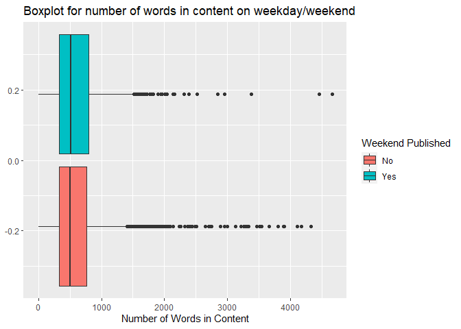

ST 558 Project 3
================
Katelyn Settlemyre, Xi Zeng
2022-10-13

# Package List

Below is the package list needed for this project.

``` r
library(tidyverse)
library(caret)
library(MASS)
library(randomForest)
```

# Introduction

The data set used for analysis is the `OnlineNewsPopularity` data set
from UCI Machine Learning Repository. The data set has 61 variables in
total, as well as 39644 observations. First, we will take a subset data
set by filter according to the data channel. There are 6 data
channels,which are `lifestyle`, `entertainment`, `bus`, `socmed`,`tech`,
`world`, .The lifestyle channel is first chosen for analysis.  
For our project, we will take variables(With description of each
variable):  
+ `n_tokens_title`: Number of words in the title  
+ `n_tokens_content`: Number of words in the content  
+ `num_imgs`: Number of images  
+ `average_token_length`: Average length of the words in the content  
+ `is_weekend`: Was the article published on the weekend?  
+ `global_rate_positive_words`: Rate of positive words in the content  
+ `num_keywords`: Number of keywords in the metadata

The response variable that we are interested in is the `shares`
variable, which stands for the number of sales in social network. A
basic EDA will be performed at first to examine the relationship between
covariates and `shares`. Then predicted modeling is applied to predict
the number of sales, which will be illustrated in detail below.

# Data read in

``` r
#Read in data
news <- readr::read_csv("OnlineNewsPopularity.csv", show_col_types = FALSE)

#Subset data with a single data channel
currentChannel <- params$Channels
subnews <- news[news[, currentChannel] == 1, ]

#Select variables for modeling and EDA
subnews <- subnews %>% dplyr::select(n_tokens_title,n_tokens_content,num_imgs,average_token_length,is_weekend,global_rate_positive_words,shares,num_keywords)
subnews$is_weekend <- as.factor(subnews$is_weekend)
```

# Data Split

In this part, our data set is split into a training set and a test set,
with training set contains 70% of the data and the test set contains the
other 30%.

``` r
#Set seed for reproduction
set.seed(123)

#Split data
index <- createDataPartition(subnews$shares,p = 0.7,list = FALSE)
train <- subnews[index,]
test <- subnews[-index,]
```

# Summarizations and EDA

In this part, basic summary statistics for the predictors are
calculated. Also, some plots,including scatter plots, barplots, and
boxplots, as well as frequency tables are generated to examine the
relationship between the variables. Since the EDA will be produced for
different channels, thus the interpretation of the plot will be less
detailed, but focus more on the trend.

``` r
#Define function for producing summary statistics
sum <- function(x){
  min <- min(x)
  mean <- mean(x)
  median <- median(x)
  max <- max(x)
  sd <- sd(x)
  return(list(Minimum = min, Mean = mean, Median = median, Maximum = max, `Standard Deviation` = sd(x)))
}

#Calculate summary statistic for variables
sum(subnews$n_tokens_title)
```

    ## $Minimum
    ## [1] 4
    ## 
    ## $Mean
    ## [1] 10.59903
    ## 
    ## $Median
    ## [1] 11
    ## 
    ## $Maximum
    ## [1] 23
    ## 
    ## $`Standard Deviation`
    ## [1] 2.083929

``` r
sum(subnews$n_tokens_content)
```

    ## $Minimum
    ## [1] 0
    ## 
    ## $Mean
    ## [1] 597.2814
    ## 
    ## $Median
    ## [1] 509
    ## 
    ## $Maximum
    ## [1] 7081
    ## 
    ## $`Standard Deviation`
    ## [1] 419.5604

We also show correlations between our selected variables. We show both a
correlation matrix and correlation plot.

``` r
#correlation matrix
(corrs <- cor(subnews[,-5]))
```

    ##                            n_tokens_title n_tokens_content    num_imgs average_token_length
    ## n_tokens_title                 1.00000000       0.05324518 -0.00813796          -0.03173449
    ## n_tokens_content               0.05324518       1.00000000  0.24321580           0.23383215
    ## num_imgs                      -0.00813796       0.24321580  1.00000000          -0.22574757
    ## average_token_length          -0.03173449       0.23383215 -0.22574757           1.00000000
    ## global_rate_positive_words    -0.05310114       0.13704763 -0.12834892           0.33397805
    ## shares                         0.04212992      -0.02011013  0.08035302          -0.06051878
    ## num_keywords                   0.02249055       0.09666407  0.06767059          -0.03178221
    ##                            global_rate_positive_words      shares num_keywords
    ## n_tokens_title                            -0.05310114  0.04212992   0.02249055
    ## n_tokens_content                           0.13704763 -0.02011013   0.09666407
    ## num_imgs                                  -0.12834892  0.08035302   0.06767059
    ## average_token_length                       0.33397805 -0.06051878  -0.03178221
    ## global_rate_positive_words                 1.00000000  0.02152962   0.12906241
    ## shares                                     0.02152962  1.00000000   0.03125003
    ## num_keywords                               0.12906241  0.03125003   1.00000000

``` r
#correlation plot
corrplot::corrplot(corrs)
```

<!-- -->

Our correlation matrix and plot shows that we don’t have strong
relationships between variables. The strongest relationship is a
correlation of 0.46 between `n_tokens_content` and `num_imgs`. Thus, we
consider removing `num_imgs` in our model fitting to avoid collinearity.

After producing summary statistics, some plots and tables are shown
below:

## Frequency tables

Below shows the frequency table of number of keywords.

``` r
 table(train$num_keywords)
```

    ## 
    ##    2    3    4    5    6    7    8    9   10 
    ##    1   78  350  702 1046 1028  886  748 1061

According to the table, we will see the frequency count of the number of
key words in each channel.

Here we have a frequency table of number of articles published on a
weekend or not.

``` r
table(subnews$is_weekend)
```

    ## 
    ##    0    1 
    ## 7341 1086

According to the table, we will see the frequency count of the articles
published during weekdays or on weekend for each channel.

## Scatter plots

Below are the scatter plots for the chosen variables.

``` r
ggplot(data = train, aes(x = global_rate_positive_words, y = shares))+
geom_point(aes(color = is_weekend)) +
  labs(x = "Rate of positive words in the content",
       y = "Number of Shares",
       title = "Scatter Plot of Shares vs Rate of positive words in the content") +
  scale_color_discrete(name = "Weekend Published", labels = c("No", "Yes"))
```

<!-- -->

According to the scatter plot above, it seems that when the rate of
positive words exceeds 0.075, the number of shares of the article is
relatively small. Also, those articles with high shares are mostly
published during weekdays rather than weekend.

``` r
ggplot(data = train, aes(x= n_tokens_content,y = shares)) + 
  geom_point() + 
  labs(x = "Number of Words",
       y = "Number of Shares",
       title = "Scatter Plot of Shares vs Number of Words in the Content")
```

<!-- -->

The above plot will show the scatter plot between the number of shares
and rate of positive words in the content. Also, the point is colored by
if the article is published on weekend. There may be difference between
the publish date or there may be curvature or linear relationship
between number of shares and rate of positive words in the content，
depending on how the scatter plot looks like.

## Barplots

Below is the bar plot for the number of keywords：

``` r
# Create bar plot of predictor "is_weekend"
g <- ggplot(data = train, aes(x = num_keywords, fill= is_weekend))
g + geom_bar(aes(fill = is_weekend),position = "dodge") +
  xlab("Number of keywords")+
  ggtitle("Bar Plot of Nmber of Keywords")+
  scale_fill_discrete(name = "Weekend Published", labels = c("No", "Yes"))
```

<!-- -->

According to the bar plot, the frequency count of the each number of
keywords is shown, also ,it will be group into weekday and weekend to
see if there is any difference between them.

``` r
ggplot(data = train, aes(x= n_tokens_title)) + 
  geom_bar() + labs(x="Words in Title", title = "Bar Plot of Number of Words in Title")
```

<!-- -->

This bar plot shows counts of articles by number of words in the title
for each channel.

## Boxplots and Jitter Plots

Below are the box plot for sales:

``` r
g <- ggplot(train, aes(x = is_weekend, y = shares))
g + geom_point(aes(color = is_weekend), position = "jitter")+
  ggtitle("Jitter Plot for shares on weekday/weekend") + xlab("is_weekend")+
  scale_color_discrete(name = "Weekend Published", labels = c("No", "Yes"))
```

<!-- -->

A jitter plot is generated to see the spread of shares data in weekdays
and weekends for each channel to see if publish data has an effect on
the shares.

Here, we show boxplots for number of words in the article by weekend and
number of keywords by weekend.

``` r
ggplot(data=train, aes(x=n_tokens_content)) +
  geom_boxplot(aes(fill=is_weekend)) +
  labs(x = "Number of Words in Content")+
  ggtitle("Boxplot for number of words in content on weekday/weekend")+
  scale_fill_discrete(name = "Weekend Published", labels = c("No", "Yes"))
```

<!-- -->

This pair of plots would suggest if there’s a difference between
weekends and weekdays for number of words in content.

``` r
ggplot(data=train, aes(x=num_keywords)) +
  geom_boxplot(aes(fill=is_weekend)) +
  labs(x = "Number of Keywords") +
  ggtitle("Boxplot for number of keywords on weekday/weekend")+
  scale_fill_discrete(name = "Weekend Published", labels = c("No", "Yes"))
```

<!-- -->

This pair of plots will suggests if articles published on the weekend
use the same number of keywords than those published on a weekday.

# Model fitting

Below is the model fitting part. In this part, four models are fitted,
those being two linear regression models, a random forest model, and a
boosted tree model. For testing goodness of fit, we will be using the
root mean squared error (RMSE).

## Linear Regression

We fit two different linear regression models here. Linear regression is
a basic method to find a linear relationship between a response variable
and one or more predictor variables. Here we will fit models using only
the main effect of predictor variables as well as adding interaction
terms of the linear models.  
First we fit the model with only first-order terms.

``` r
#Use predictors used for the model
lmod_1 <- train(shares~  n_tokens_title + n_tokens_content + average_token_length + is_weekend +global_rate_positive_words + num_keywords,
                    data = train,
                    method = "lm",
                    trControl = trainControl("cv",number=10))

summary(lmod_1)
```

    ## 
    ## Call:
    ## lm(formula = .outcome ~ ., data = dat)
    ## 
    ## Residuals:
    ##    Min     1Q Median     3Q    Max 
    ##  -4645  -1460   -980   -269 281732 
    ## 
    ## Coefficients:
    ##                             Estimate Std. Error t value Pr(>|t|)    
    ## (Intercept)                 2705.310    708.742   3.817 0.000136 ***
    ## n_tokens_title               112.619     40.115   2.807 0.005011 ** 
    ## n_tokens_content              -0.157      0.206  -0.762 0.445878    
    ## average_token_length        -579.030    103.164  -5.613 2.08e-08 ***
    ## is_weekend1                  625.947    250.871   2.495 0.012620 *  
    ## global_rate_positive_words 19106.282   6306.457   3.030 0.002459 ** 
    ## num_keywords                  72.375     44.907   1.612 0.107088    
    ## ---
    ## Signif. codes:  0 '***' 0.001 '**' 0.01 '*' 0.05 '.' 0.1 ' ' 1
    ## 
    ## Residual standard error: 6408 on 5893 degrees of freedom
    ## Multiple R-squared:  0.009477,   Adjusted R-squared:  0.008468 
    ## F-statistic: 9.397 on 6 and 5893 DF,  p-value: 2.739e-10

``` r
#Fit model with selected variables on test data
lmod_pred <- predict(lmod_1, newdata = test)

#Calculate test error
lmod1_RMSE <- RMSE(lmod_pred,test$shares)
lmod1_RMSE
```

    ## [1] 5181.112

Now we fit the linear model with a polynomial term. Since in our EDA
there seems to be a curvature relationship between
`global_rate_positive_words` and `shares`, thus, a polynomial term is
added here.

``` r
#Fit linear model using different predictors with polynomial term
lmod2 <- train(shares~ n_tokens_title + n_tokens_content + average_token_length + is_weekend +global_rate_positive_words + num_keywords + I(global_rate_positive_words^2),
               data = train,
               method = "lm",
               trControl = trainControl("cv",number= 10))

summary(lmod2)
```

    ## 
    ## Call:
    ## lm(formula = .outcome ~ ., data = dat)
    ## 
    ## Residuals:
    ##    Min     1Q Median     3Q    Max 
    ##  -4603  -1492   -978   -251 281627 
    ## 
    ## Coefficients:
    ##                                     Estimate Std. Error t value Pr(>|t|)    
    ## (Intercept)                        2.717e+03  7.087e+02   3.834 0.000128 ***
    ## n_tokens_title                     1.113e+02  4.012e+01   2.774 0.005553 ** 
    ## n_tokens_content                  -2.062e-01  2.080e-01  -0.991 0.321575    
    ## average_token_length              -6.792e+02  1.191e+02  -5.703 1.23e-08 ***
    ## is_weekend1                        6.412e+02  2.510e+02   2.555 0.010657 *  
    ## global_rate_positive_words         5.431e+04  2.185e+04   2.485 0.012965 *  
    ## num_keywords                       6.710e+01  4.501e+01   1.491 0.136043    
    ## `I(global_rate_positive_words^2)` -4.771e+05  2.836e+05  -1.683 0.092498 .  
    ## ---
    ## Signif. codes:  0 '***' 0.001 '**' 0.01 '*' 0.05 '.' 0.1 ' ' 1
    ## 
    ## Residual standard error: 6407 on 5892 degrees of freedom
    ## Multiple R-squared:  0.009952,   Adjusted R-squared:  0.008776 
    ## F-statistic: 8.461 on 7 and 5892 DF,  p-value: 2.437e-10

``` r
#fit with test data
lmod2_pred <- predict(lmod2, newdata = test)

#test error:
(lmod2_RMSE <- RMSE(lmod2_pred,test$shares))
```

    ## [1] 5179.886

## Random Forest Model

Here we fit a random forest model. A random forest is an method where
multiple tree models are fit from bootstrap samples using a subset of
predictor variables for each bootstrap sample. The final prediction is
an average of the bootstrap predictions. We use the tuning parameter
`mtry`, the number of randomly selected predictors, using values 1
through 3 to fit the best tune.

``` r
#set tuning parameters
rand_grid <- data.frame(mtry=1:3)

#train model
rand_fit <- train(shares~n_tokens_title + n_tokens_content + average_token_length + is_weekend +global_rate_positive_words + num_keywords,
                  data = train,
                  method = "rf",
                  preProcess = c("center", "scale"),
                  trControl = trainControl(method = "repeatedcv", number = 5, repeats = 3),
                  tuneGrid = rand_grid)
rand_fit$bestTune
rand_fit$finalModel
```

    ## 
    ## Call:
    ##  randomForest(x = x, y = y, mtry = param$mtry) 
    ##                Type of random forest: regression
    ##                      Number of trees: 500
    ## No. of variables tried at each split: 1
    ## 
    ##           Mean of squared residuals: 41219859
    ##                     % Var explained: 0.46

``` r
#fit with test data
rand_pred <- predict(rand_fit, newdata = test)

#test error:
(rand_RMSE <- RMSE(rand_pred, test$shares))
```

    ## [1] 5171.654

## Boosted Tree Model

Below is the process of fitting a boosted tree model. A boosted tree is
a method that builds sequentially. It’s a slow-building method, that
builds a new tree considering the error of the previous fit, updating
predictions each new fit. Model performance is tested by fitting the
final tuned model on test set and calculate the test RMSE. Here, we use
combinations of the following tuning parameters:  
+ `n.trees`, the number of boosting iterations, with values 25, 50, 100,
150, and 200  
+ `interaction.depth`, the maximum tree depth, with values 1 through 5  
+ `shrinkage`, the learning rate of the model, with values 0.1, 0.2,
0.3, 0.4, and 0.5, and  
+ `n.minobsinnode`, the minimum node size, here using 10.

``` r
#Set tuning grid for boosted tree model
boost_grid <- expand.grid(n.trees = c(25,50,100,150,200),
                          interaction.depth = c(1:5),
                          shrinkage = c(0.1,0.2,0.3,0.4,0.5),
                          n.minobsinnode = 10)
#boost_grid

#Train the model
boost_fit <- train(shares ~n_tokens_title + n_tokens_content + average_token_length + is_weekend +global_rate_positive_words + num_keywords,
                   data = train,
                   method = "gbm",
                   trControl = trainControl(method = "repeatedcv", number = 5, repeats = 3),
                   preProcess = c("center", "scale"),
                   tuneGrid = boost_grid,
                   verbose = FALSE)

boost_fit$bestTune

#Fit the final boosted tree model with test data
boost_pred <- predict(boost_fit, newdata = test)

#Calculate test RMSE for model performance
boost_RMSE <- RMSE(boost_pred,test$shares)
boost_RMSE
```

    ## [1] 5183.61

# Comparison

Though the RMSE for the testing data has been given for each model in
the previous section, we shall display them here and compare the models’
performances.

``` r
#create and print data frame of models and RMSE's
(fit_RMSE <- data.frame(Model = c("Linear Regression, first-order", "Linear Regression, polynomial", "Random Forest", "Boosted Tree"), RMSE = c(lmod1_RMSE, lmod2_RMSE, rand_RMSE, boost_RMSE)))
```

The lower the RMSE, the better the fit. Therefore, we choose the model
with the lowest RMSE for each channel, printed below:

``` r
#Select row with lowest RMSE value and print
min_val <- min(fit_RMSE$RMSE)
fit_RMSE[fit_RMSE$RMSE == min_val,]
```

# Automation

Below is the part for automating the output for each channel:

``` r
channels <- c("data_channel_is_lifestyle", "data_channel_is_entertainment", "data_channel_is_bus", "data_channel_is_socmed", "data_channel_is_tech", "data_channel_is_world")
# Create file names
name <- c("Lifestyle", "Entertainment", "Business", "SocialMedia",
          "Technology", "World")
output_file <- paste0(name, "ChannelAnalysis.md")
# Create a list for each channel with just channel name parameter
parameters = lapply(channels, FUN = function(x){
  list(Channels = x)
})
# Put into a data frame
reports <- tibble::tibble(output_file, parameters)
#options(knitr.duplicate.label = "allow")
# Automation
apply(reports, MARGIN = 1, FUN = function(x) {
  rmarkdown::render(input = "project3.Rmd", 
                    output_format = "github_document", 
                    output_file = x[[1]], 
                    params = x[[2]], 
                    output_options = list(html_preview = FALSE)) 
})
```
